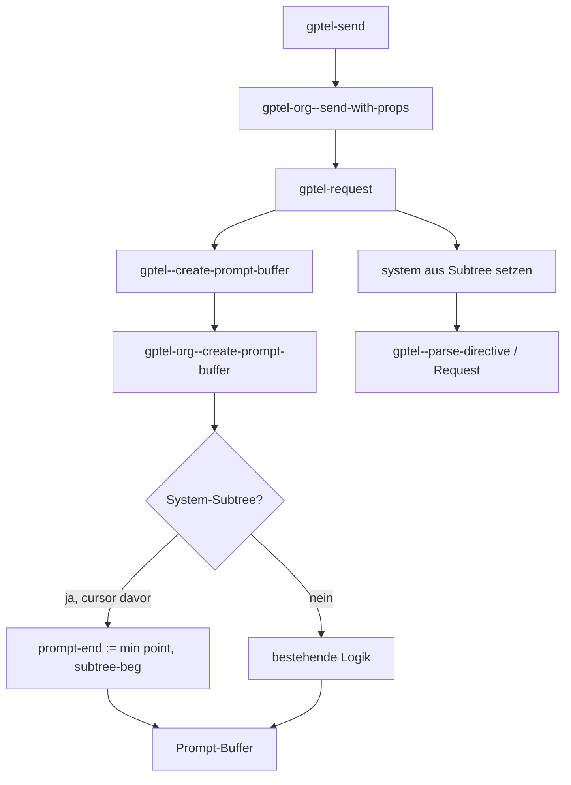

# Konzept: System-Message per Subtree am Dateiende (gptel-send)

> **Hinweis:** Maßgeblich für die **Implementierung** ist
> `mydocs/gptel-send-extension.md` (Begin/End-Marker `GPTEL_SYSTEM_MESSAGE` /
> `GPTEL_SYSTEM_MESSAGE_END`, plain-text, keine Org-Baumlogik). Dieses
> Konzept-Dokument enthält historische Entwürfe; Abschnitte ohne Hinweis können
> veraltet sein.

Ausgangspunkt: `mydocs/gptel-send-extension-prompt.md`.  
Ziel ist eine Erweiterung von `gptel-send`, zuerst für Org-Dateien, später
erweiterbar auf andere Formate (z. B. Emacs-Lisp).

---

## 1. Problem und gewünschtes Verhalten

### Ist-Zustand

- `gptel-send` sendet standardmäßig den Pufferinhalt **bis zur Cursorposition**
  (`gptel--create-prompt-buffer` → `gptel-org--create-prompt-buffer`).
- Die System-Message kommt aus `gptel--system-message` (Buffer-lokal,
  Transient-Menü, Presets) bzw. in Org zusätzlich aus der Property
  `GPTEL_SYSTEM` am **aktuellen Heading** (`gptel-org--entry-properties`,
  Advice `gptel-org--send-with-props`).

### Soll-Zustand (Org, Phase 1)

Am **Ende des Org-Puffers** liegt ein klar markierter **Subtree** mit der
System-Message. Beim Senden:

1. Liegt der Cursor **vor** diesem Subtree, wird nur der Text **bis zum Cursor**
   als Konversations-Prompt geparst; der System-Subtree erscheint **nicht** in
   den User-/Assistant-Nachrichten.
2. Der Inhalt des System-Subtrees wird stattdessen als **`system`-Message**
   an das Backend übergeben (analog zu `gptel--system-message`).
3. Der System-Subtree soll **immer am Dateiende** stehen (Konvention +
   optional Validierung).

Das entspricht dem mentalen Modell: unten die „Konfiguration“, oben der Chat —
und `gptel-send` schickt nur den sichtbaren Gesprächsteil, nicht die
Konfiguration mit.

---

## 2. Abgrenzung zu bestehenden gptel-Org-Features

| Mechanismus | Wo | Rolle |
|-------------|-----|--------|
| `GPTEL_SYSTEM` Property | Heading unter Cursor | System-Message pro Org-Überschrift (bestehend) |
| `GPTEL_TOPIC` | Heading | Begrenzt Prompt auf Topic-Region |
| `gptel-org-set-properties` | Heading | Persistiert Buffer-State in Properties |
| **Neu: System-Subtree** | Dateiende | System-Message im Buffer-Text, nicht in Properties |

**Priorität (Vorschlag für Phase 1):**

1. Explizites Argument an `gptel-request` / Transient-Override (unverändert
   höchste Priorität).
2. **System-Subtree am Dateiende**, wenn erkannt und Cursor davor.
3. `GPTEL_SYSTEM` am aktuellen Heading (`gptel-org--send-with-props`).
4. Buffer-lokales `gptel--system-message` / Preset.

Konflikte zwischen (2) und (3) sollten dokumentiert und per User-Option
steuerbar sein (`gptel-org-system-section-priority` o. ä.).

---

## 3. Markierung des System-Subtrees (Org)

Anforderungen:

- Eindeutig maschinenlesbar.
- Für Menschen im Org-Dokument erkennbar.
- Stört normales Org-Rendering nicht.
- Später analog übertragbar auf andere Formate.

### Empfohlene Markierung (Primärvorschlag)

**Eigene Überschrift am Dateiende** mit fester Property:

```org
* System prompt
:GPTEL_SYSTEM_MESSAGE: t
Dieser Text ist die System-Message.
:GPTEL_SYSTEM_MESSAGE_END: t
```

- **Implementiert:** Begin/End als Zeilenmarker (Org-Property oder
  Kommentarpräfix); Inhalt **zwischen** den Zeilen; siehe
  `gptel-send-extension.md`.
- Überschrift darüber ist optional und gehört nicht zum System-Text.

---

## 4. Erkennung und Grenzen

### 4.1 Section finden (implementiert)

```elisp
(gptel-org--system-section-bounds)
;; => (BEG . END) oder nil   ; BEG/END = Marker-Zeilen
```

Algorithmus (plain-text, kein `org-map-entries`):

1. `widen`, `goto-char (point-max)`.
2. Rückwärts: letzte Zeile mit End-Marker `GPTEL_SYSTEM_MESSAGE_END`.
3. Rückwärts: letzte Zeile mit Begin-Marker `GPTEL_SYSTEM_MESSAGE` davor.
4. Optional EOF: nur Leerzeichen nach der End-Marker-Zeile
   (`gptel-org-require-system-section-at-eof`).

### 4.2 Prompt-Ende begrenzen

In `gptel-org--create-prompt-buffer` (oder unmittelbar davor):

```text
effective-end = min(prompt-end, system-beg)   wenn point < system-beg
effective-end = prompt-end                      sonst (Cursor im/im nach Subtree)
```

- **Region aktiv:** Region hat Vorrang; System-Subtree-Logik nur anwenden,
  wenn Region den Subtree nicht schneidet (sonst User-Warnung).
- **`GPTEL_TOPIC`:** Topic-`narrow` bleibt; System-Subtree liegt typischerweise
  außerhalb des Topics → dann greift Subtree-System-Message trotzdem für die
  gesamte Anfrage (gewollt?) oder nur wenn Topic den Subtree einschließt —
  **entscheiden:** Vorschlag = System-Subtree gilt **buffer-weit**, unabhängig
  vom Topic (Konfiguration ist global pro Datei).

### 4.3 System-Text extrahieren

Neue Funktion:

```elisp
(gptel-org--system-section-message bounds)
;; => String oder nil
```

- Kopie des Subtree-Inhalts (ohne Heading-Zeile, ohne Property-Drawer),
  gleiche Nachbearbeitung wie Prompt (`gptel-org--strip-block-headers`,
  optional `gptel-org--strip-elements` für Property-Drawer im System-Teil).
- Kein Rückwärts-Parsen als User/Assistant-Turns.

### 4.4 Cursor im System-Subtree

| Situation | Verhalten (Vorschlag) |
|-----------|------------------------|
| Cursor im Subtree, kein Prefix | User-Error oder Message: „Cursor im System-Subtree — bitte darüber positionieren.“ |
| Cursor im Subtree, Prefix / explizit | Subtree-Inhalt als normaler Prompt (Escape-Hatch) — optional, Phase 2. |
| Cursor genau auf `system-beg` | Wie „davor“: Subtree nicht im Prompt, nur als System. |

---

## 5. Integration in die Send-Pipeline



### Hook-Punkte (minimal-invasiv)

1. **`gptel-org--create-prompt-buffer`**  
   `effective-end` setzen (Abschnitt 4.2).

2. **Neuer Advice auf `gptel-request` oder Erweiterung von
   `gptel-org--send-with-props`**  
   Vor dem Request: wenn Subtree-Message vorhanden →
   `setq-local gptel--system-message` (oder nur für diesen Request via
   `let`-Binding im Advice — bevorzugt, um Buffer-State nicht dauerhaft zu
   überschreiben).

3. **Optional: `gptel-org-set-properties`**  
   Beim Speichern: Subtree-Inhalt **nicht** nach `GPTEL_SYSTEM` am Root
   spiegeln (Doppelung vermeiden), oder explizit dokumentieren, dass Subtree
   und Property getrennte Wege sind.

Keine Änderung an `gptel.el` nötig, wenn Org alles in `gptel-org.el` hält
(analog zu `gptel-org--create-prompt-buffer` via `cond` in
`gptel--create-prompt-buffer`).

---

## 6. Erweiterbarkeit (Phase 2+: Lisp und andere Formate)

### Generische Schnittstelle (Vorbereitung in Phase 1)

In `gptel.el` (oder `gptel-request.el`) Platzhalter:

```elisp
(cl-defgeneric gptel--system-message-region (mode)
  "Return (BEG . END) of the buffer-local system-message region, or nil.")

(cl-defgeneric gptel--system-message-text (mode bounds)
  "Return system message string for BOUNDS.")
```

Org implementiert diese Methoden; Default-Methode liefert `nil`.

`gptel--create-prompt-buffer` ruft generisch ab:

```elisp
(when-let ((bounds (gptel--system-message-region major-mode)))
  (setq prompt-end (min (or prompt-end (point)) (car bounds))))
```

### Emacs-Lisp (später)

Anforderung aus Prompt: Datei muss **gültiges Lisp** bleiben; System-Teil vom
Interpreter ignoriert.

Mögliche Markierungen:

```elisp
;;; gptel-system-message-begin
(defvar gptel-local-system-message
  "Mehrzeiliger String…")
;;; gptel-system-message-end
```

- `defvar` wird geladen, aber nicht von `gptel-send` als Prompt gesendet;
  Inhalt aus String-Literal extrahieren (oder nur Kommentar-Block + ein
  `defconst` mit `eval-when-compile nil` — weniger schön).
- Alternative: nur Kommentare mit festem Präfix am Dateiende — für Menschen
  lesbar, Parsing per Regex; keine gültige „Daten“-Struktur.

Org-Property-Muster lässt sich nicht 1:1 übertragen; die **generische API**
(oben) ist der gemeinsame Kern.

---

## 7. Konfiguration und UX

| Option | Typ | Default | Zweck |
|--------|-----|---------|--------|
| `gptel-org-use-system-section` | boolean | `t` | Feature ein/aus |
| `gptel-org-system-section-property` | string | `"GPTEL_SYSTEM_MESSAGE"` | Begin-Marker |
| `gptel-org-system-section-end-property` | string | `"GPTEL_SYSTEM_MESSAGE_END"` | End-Marker |
| `gptel-org-require-system-section-at-eof` | boolean | `t` | Strikte EOF-Prüfung |
| `gptel-org-system-section-priority` | choice | `subtree` | `subtree` vs `heading-property` bei Konflikt |

**Hilfsbefehle (optional, Phase 1b):**

- `gptel-org-insert-system-section` — Template am Dateiende einfügen.
- `gptel-org-validate-system-section` — EOF + genau ein Subtree.

**Dokumentation:** README.org Abschnitt Org / reproducible chats; ein Eintrag in
NEWS.

---

## 8. Testplan

### Unit-/Batch-Tests (Emacs, ohne Netz)

Neues File `test/gptel-org-system-section-tests.el` (oder unter `scripts/` wie
bestehende Org-Tests im Fork — upstream bevorzugt `test/` sobald Submodule
genutzt wird):

1. Subtree am Ende, Cursor darüber → Prompt enthält Subtree-Text nicht;
   extrahierte System-Message stimmt.
2. Kein Subtree → unverändertes Verhalten.
3. Zwei Subtrees mit Property → Warnung, erster/letzter definieren (festlegen:
   **nur der letzte** zählt).
4. Subtree nicht am EOF → ignorieren + Warnung (wenn Option an).
5. `GPTEL_TOPIC` + Subtree außerhalb Topic → erwartetes Verhalten (Test 5
   dokumentiert Entscheidung aus 4.2).
6. Interaktion mit `GPTEL_SYSTEM` Property — Prioritäts-Option.

Regression: bestehende `gptel-org--create-prompt-buffer`-Tests / manuell
`batch-byte-compile`.

### Manuell

1. Org-Datei mit Chat-Überschriften + System-Subtree unten.
2. `gptel-send` mit Cursor in letzter User-Nachricht.
3. `gptel--inspect-query` / Dry-Run: System-Teil getrennt, Prompt ohne Subtree.

---

## 9. Implementierungsphasen

| Phase | Inhalt | Aufwand (grob) |
|-------|--------|----------------|
| **1a** | Bounds + Extraktion + Prompt-Ende in `gptel-org.el` | klein |
| **1b** | Advice für `gptel--system-message` pro Request | klein |
| **1c** | Customizations + README/NEWS | klein |
| **1d** | Batch-Tests | mittel |
| **2** | `cl-defgeneric` + Refactor Org auf Generics | klein |
| **3** | Emacs-Lisp-Marker + Methoden | mittel |
| **4** | Markdown/other modes | offen |

Phase 1 bewusst **ohne** Lisp — entspricht dem Prompt („erst mal für
org-Dateien“).

---

## 10. Entscheidungen 

1. **Topic vs. globaler System-Subtree** — buffer-weit 
2. **Cursor im Subtree** — harter Fehler
3. **Merge mit `gptel--parse-directive`** — ja wie bei `GPTEL_SYSTEM`
4. **Org-Export** — soll der System-Subtree bei normalem Export sichtbar bleiben?
   ja
5. **Ein Subtree pro Datei** erster gefundener, sonst Warnung

---

## 11. Beispiel-Datei (Zielbild)

```org
* Chat

** User
Was ist 2+2?

** Assistant
4

* System prompt
:GPTEL_SYSTEM_MESSAGE:
Du bist ein hilfreicher Assistent für Mathe-Fragen.
Antworte knapp.
```

Cursor in `** User` → Prompt enthält die Frage (und ggf. Historie), System-Text
nur als `system`-Rolle im API-Request.

---

## 12. Kurzfassung

Die Erweiterung nutzt einen **markierten Org-Subtree am Dateiende** als
lebbare System-Message. Technisch wird **`gptel-org--create-prompt-buffer`**
um eine obere Grenze vor diesem Subtree ergänzt und **`gptel-request`**
um eine temporäre System-Message aus dem Subtree-Inhalt. Die Architektur
sollte von Anfang an über **generische Bounds/Text-Funktionen** andere
Dateitypen vorbereiten, ohne Phase 1 zu verkomplizieren.
